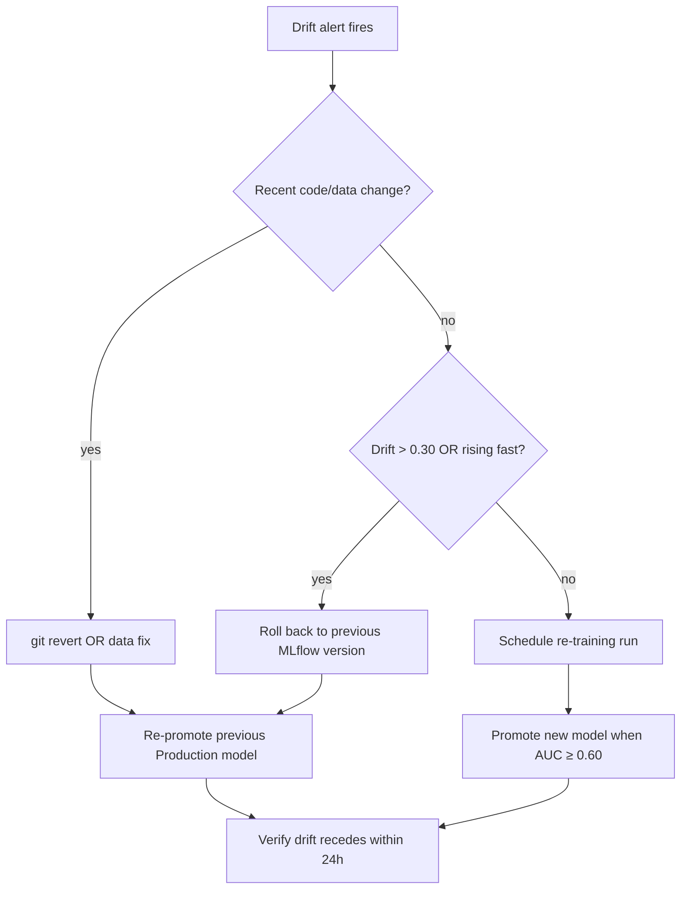

# Customer Churn drift SLO — runbook

> **Phase E runbook** for shared ADR-0061. Pairs with
> [`bin/ml/compute_drift.py`](../../bin/ml/compute_drift.py),
> the Prometheus rules in
> [`deploy/kubernetes/observability-prom/mirador-drift-alerts.yaml`](../../deploy/kubernetes/observability-prom/mirador-drift-alerts.yaml),
> the CronJob in
> [`deploy/kubernetes/canary/ml-drift-cronjob.yaml`](../../deploy/kubernetes/canary/ml-drift-cronjob.yaml),
> and the Grafana dashboard at
> [`infra/observability/grafana/dashboards-lgtm/mirador-churn-drift.json`](../../infra/observability/grafana/dashboards-lgtm/mirador-churn-drift.json).

A churn-prediction model that drifts away from its training
distribution silently degrades : the JVM still serves predictions,
the API still returns 200, but the probabilities no longer
correspond to real churn risk. The drift SLO surfaces that drift
BEFORE the business notices.

## Signal definition (recap)

| Layer | Owner |
|---|---|
| Daily KS-test per feature | `bin/ml/compute_drift.py` (CronJob) |
| Push to Prometheus | Pushgateway → `mirador_churn_drift_ks_stat{feature, model}` |
| SLO target | 99 % of samples with `max(KS-stat) < 0.20` over 30 days |
| Alert routing | 4-tier multi-window/burn-rate (page / page / ticket / ticket) per ADR-0058 |
| Visualisation | Grafana dashboard `mirador-churn-drift` |

The 0.20 threshold comes from Tabachnick + Fidell, *Using
Multivariate Statistics* — KS-stat ≥ 0.20 between two same-N
samples is the literature's "actionable drift" cut-off.

## Alert table

| Alert | Severity | Trigger | Action |
|---|---|---|---|
| `ChurnDriftBudgetBurnFast` | critical (page) | 2 % of 30d budget in 1h | Same hour : open Grafana, identify the most-drifted feature, assess re-train urgency. |
| `ChurnDriftBudgetBurnSustained` | critical (page) | 5 % of 30d budget in 6h | Within 4h : decide between rollback to a prior MLflow version (re-promote) or accelerate a re-training run. |
| `ChurnDriftSlowErosion` | warning (ticket) | 10 % in 1d | Within 1 business day : check correlation with the latest deploy / data-pipeline change. |
| `ChurnDriftBaselineErosion` | warning (ticket) | 10 % in 3d | Schedule a re-training run within the sprint. |
| `ChurnDriftStaleData` | warning (ticket) | No CronJob push in > 36h | Check the CronJob status + the last Job's pod logs. |

## Triage flow

### Step 1 — Identify which feature drifted

Open the [Grafana dashboard](http://localhost:3001/d/mirador-churn-drift/customer-churn-model-drift-phase-e)
("Per-feature drift over time" panel). The top trace is the worst
offender. Common patterns :

- **Single feature spiked** → a data-pipeline change. Run
  `git log --since=7d -- src/mirador_service/ml/feature_engineering.py`
  to spot a recent change ; if found, that's likely the cause.
- **Multiple features rising together** → real population shift
  (seasonality, marketing campaign, geographical expansion).
  Re-training is the right answer.
- **`email_domain_class` rising** → influx of users from a new
  email provider (e.g. a corporate-domain partnership). Often
  benign — bump the threshold for that one feature, OR re-train.
- **Revenue features (`total_revenue_*d`) rising** → either price
  changes or a different customer segment. Check the Sales /
  pricing change-log.

### Step 2 — Decide : roll back or re-train



### Step 3 — Take the action

#### Rollback to the previous Production model

```bash
# Identify the previous Production version in MLflow.
mlflow models get-model-version-stages \
  --name customer-churn-mlp \
  --version <N-1>

# Re-promote it through the standard script.
bin/ml/promote_to_configmap.sh --version <N-1> --yes
```

The promotion triggers a rolling restart of both backends ; pods
load the older model on boot ; the drift series should recede
within 24 h (next CronJob run).

#### Re-train + promote a fresh model

```bash
cd ../mirador-service-python
uv run python -m mirador_service.ml.train_churn \
  --data-source postgres \
  --output ./model.onnx
# The training script logs to MLflow + tags as 'Staging' if AUC ≥ 0.60.
# Promote to Production via the MLflow UI or CLI :
mlflow models transition-stage \
  --name customer-churn-mlp \
  --version <N> \
  --stage Production \
  --archive-existing-versions
# Then run the standard ConfigMap promotion script.
bin/ml/promote_to_configmap.sh --yes
```

### Step 4 — Verify recovery

After 24 h (next CronJob run), re-open the Grafana dashboard.
Expected :

- "Drift today — max across features" stat goes back below 0.20.
- "30-day error budget remaining" stops ticking down.
- 1h burn-rate drops below 14.4×.

If drift persists after 48 h despite a rollback / re-train, the
issue is not the model — it's a systemic feature-pipeline bug or
a real population shift that the architecture can't accommodate.
Escalate via the on-call rotation lead + open a postmortem.

## Common failure modes

| Symptom | Likely cause | Fix |
|---|---|---|
| `ChurnDriftStaleData` fires repeatedly | CronJob never runs | `kubectl describe cronjob mirador-churn-drift -n mirador` ; check `Last Schedule Time` ; if Never, the schedule is wrong or the namespace is paused. |
| CronJob pods crash with `RuntimeError: no Production-tagged version` | Nothing in MLflow registry | Run a training run + promote via the MLflow UI. The drift script needs a baseline. |
| CronJob pods crash with `connection refused` to MLflow | MLflow service is down | `kubectl get svc mlflow -n mlflow` ; if no endpoints, the MLflow pod hasn't started. |
| Drift gauge stays at 0 even when reality drifts | `training_features.csv` artefact missing on the Production run | Re-train + log the artefact (the training script does this automatically since Phase A). |
| All features drift simultaneously by exactly the same amount | The current-population query window is wrong | Check `--lookback-days` argument ; default 30 d should match the training window. |
| KS-stat NaN | One side has < 2 samples | `--lookback-days` too short for the customer creation rate. Bump to 90 d during ramp-up. |

## Production deployment (vs dev)

The dev `compose/dev-stack.yml` runs MLflow with SQLite + local
file artifacts. Production deployments swap to :

| Component | Dev | Production |
|---|---|---|
| MLflow backend | `sqlite:///mlflow.db` | Postgres (a small managed instance, e.g. Cloud SQL `db-f1-micro`) |
| Artifact store | `/mlflow/artifacts` (local) | S3 / GCS bucket |
| Pushgateway | n/a (skip via `--skip-push`) | `prometheus-pushgateway.monitoring.svc.cluster.local:9091` |
| Schedule | manual / on-demand | daily CronJob at 03:00 UTC |
| Resource requests | 200m / 512Mi | same — drift is cheap (< 1 GB RAM, < 5 min) |

## Wiring the dashboard

Grafana provisioning picks up the dashboard automatically when
`infra/observability/grafana/dashboards-lgtm/` is mounted into
the `lgtm` container — the file we just dropped is enough. For
Grafana Cloud (production), import the JSON manually through the
UI or via a Terraform module (out of scope for this runbook).

## SLO review schedule

Per [`docs/slo/review-cadence.md`](../slo/review-cadence.md), the
drift SLO joins the monthly review alongside Availability +
Latency p99 + Enrichment success. Specific items to bring :

- Compliance % over the last 30d (from this runbook's dashboard).
- Top 3 feature contributors to budget burn.
- Did any model promotion happen this month? Cross-correlate with
  the drift series — promotions should NOT cause spikes.
- Schedule a re-training run if drift > 0.15 even when below the
  alert threshold (proactive ; relax the threshold later if it
  fires too often).

## Related

- [shared ADR-0058 — SLO/SLA with Sloth](../adr/0058-slo-sla-with-sloth.md)
- [shared ADR-0061 — Customer Churn](../adr/0061-customer-churn-prediction.md)
- [shared ADR-0062 — MLflow registry + ConfigMap promotion](../adr/0062-mlflow-registry-configmap-promotion.md)
- [`docs/ml/promote-churn-model.md`](promote-churn-model.md) — the model promotion runbook (Phase F).
- [Java feature doc](https://gitlab.com/mirador1/mirador-service-java/-/blob/main/docs/ml/churn-prediction.md).
- [Python feature doc](https://gitlab.com/mirador1/mirador-service-python/-/blob/main/docs/ml/churn-prediction.md).
